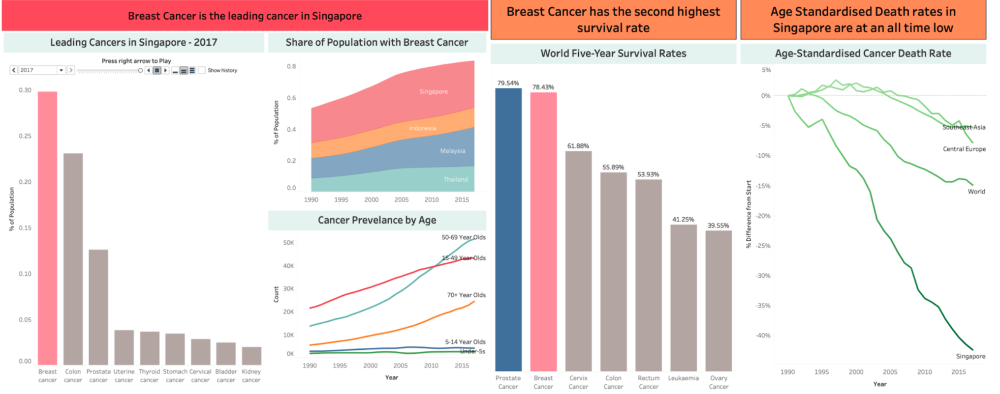
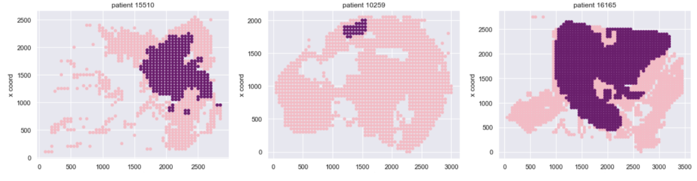

# Breast Cancer Prediction

## LifeHack 2020 Winner

Our project is crafted to aid the current healthcare system to combat against the  biggest challenges regarding Breast Cancer in Singapore - Awareness and Prediction

With our Tableau Dashboard, we aim to raise greater awareness for the general population about the risk and dangers of breast cancer, while giving hope through statistics that our ever improving medical facilities can treat breast cancer well.

Our predictive analytics aim to provide a comprehensive risk projection based on demographic information  for individuals.

We also aim to provide accurate predictions of  cancer for individuals based on clinical data.

## Tableau Dashboard

With our Tableau Dashboard, we aim to raise greater awareness for the general population about the risk and dangers of breast cancer, while giving hope through statistics that our ever improving medical facilities can treat breast cancer well.

## Prediction
- CNN Model
- Logistic Regression with PCA Reduction
- BCRA Risk Projection

### BCRA
BCRA is an R Package providing risk projections of invasive breast cancer based on the Gail Model without extensive screening. 
We engineered an intuitive interface for this model to help calculate risk for individuals, especially for those under the age of 50 (with 5 year and lifetime projections).

### Predictive Analytcs - Ensemble Modelling

##### Logistic Regression 
Logistic Regression from a dimensionality reduced dataset of Wisconsin Breast Cancer Diagnostic Dataset predicting malignant vs benign tumors using PCA provided an accuracy of  0.988.
30 Features are computed from a digitized image of a fine needle aspirate (FNA) of a breast mass. The objective is the prediction of Malignant vs Benign Cell Nuclei. 

#### Mammogram images to predict Invasive Ductal Carcinoma (IDC) tissue
Trained a CNN Model for the prediction.
We use a pretrained model on the Imagenet Dataset (14 million images) as our dataset only has about 280 patients (and 270k images). The pretrained model allows us to directly detect edges and structure. The biases are then updated specific to our own dataset.

<image src="./images/image-1.png" height=400px/>
The image on the left shows the original input with the ICD areas highlighted in purple and on the right shows the probability map that the model has learnt. The higher the probability of ICD at that spot/pixel the darker the colour.

